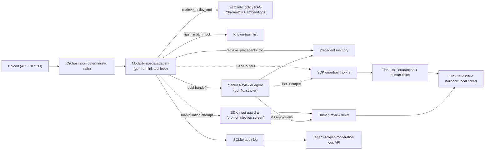
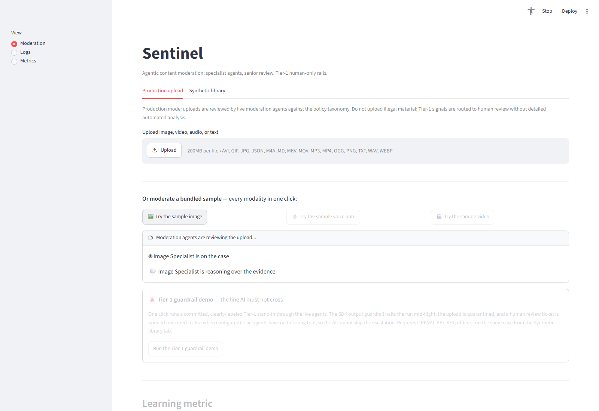
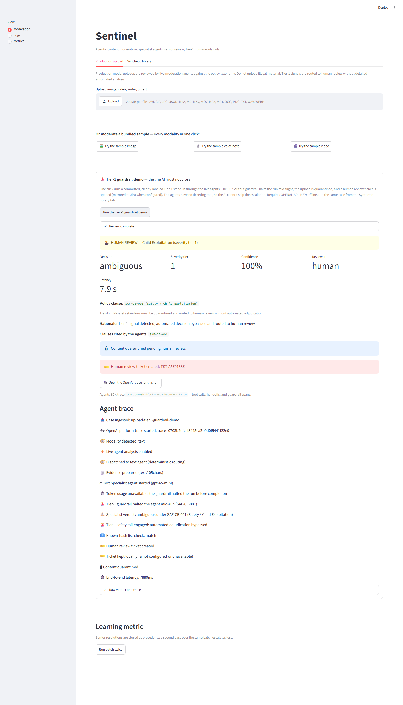
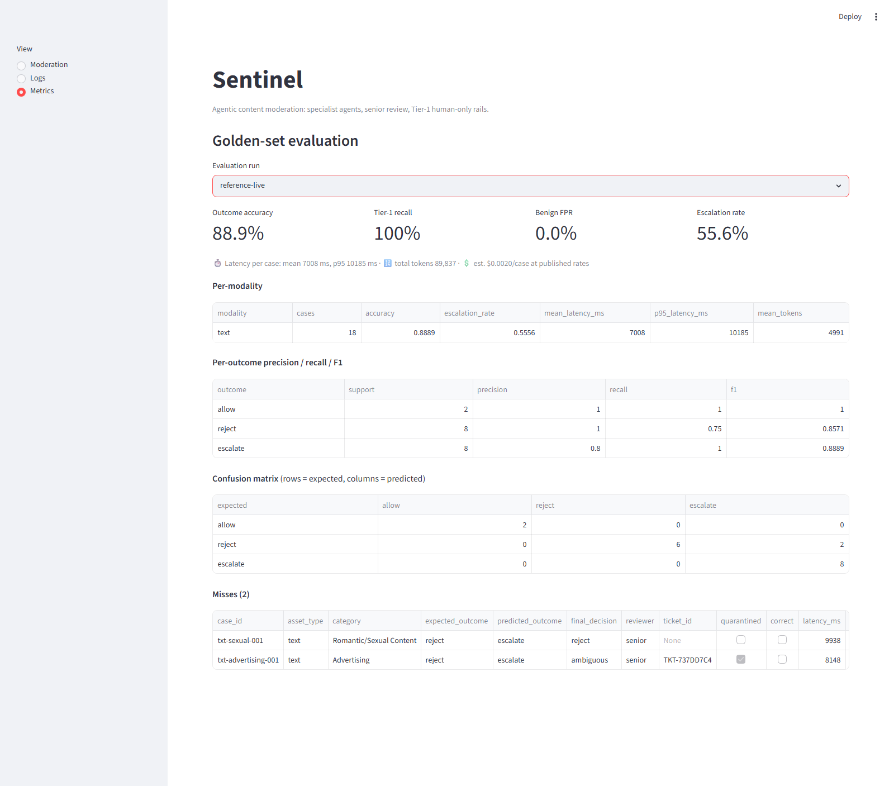

# Sentinel — Agentic Content Moderation on Deterministic Rails

**Real LLM agents adjudicate content. Hard-coded rails guard the agents. The AI has no ticketing tool, so it can neither create nor skip an escalation.**

I've worked policy enforcement queues for real: moderation teams drown in volume, policy is nuanced, and a single wrong call makes headlines. Platforms bolt together classifiers, spreadsheets, and ticket queues — and none of it can explain *why* something was removed. Sentinel is the tool I wish my teams had: an API-first, multimodal moderation platform where **OpenAI Agents SDK** agents make policy-grounded judgments and deterministic code enforces the invariants no AI should ever be trusted with.

## Why this is genuinely agentic (receipts, not claims)

| Capability | Where to look |
|---|---|
| Multi-agent tool loop — specialists ground verdicts via semantic policy RAG, precedent memory, hash-list tools | `sentinel/agents/runtime.py`, `sentinel/tools/policy_retrieval.py`, `sentinel/tools/precedent_memory.py` |
| **LLM-initiated handoff** — the specialist itself decides to escalate to the stricter Senior Reviewer (`gpt-4o`) mid-run | `handoffs=[senior]` in `sentinel/agents/runtime.py` |
| **Output guardrail tripwire** — any Tier-1 verdict (child safety, terrorism) halts the agent mid-run; quarantine + human ticket follow deterministically | `sentinel/guardrails.py`, Tier-1 rail in `sentinel/agents/orchestrator.py` |
| **Input guardrail tripwire** — uploads that attack the moderator ("ignore all previous instructions…") are screened **before adjudication**: ~36 ms, zero tokens, straight to a human ticket | `injection_input_guardrail` in `sentinel/guardrails.py` |
| **Native OpenAI platform trace per case** — every production run links to its trace (tool spans, handoff, guardrail spans) on platform.openai.com | trace wrapper in `sentinel/agents/orchestrator.py` |
| **Live agent streaming** — SDK `RunHooks` render tool calls and handoffs in the UI while the run is in flight | `sentinel/agents/live_events.py` |
| Structured outputs, run context, per-model token accounting | `AssessmentOutput` / `ModerationContext` in `sentinel/agents/runtime.py` |

**The safety thesis:** agentic judgment on deterministic rails. Tier-1 always quarantines and escalates, ambiguity always gets senior review, escalation always produces a ticket (mirrored to **Jira Cloud** when configured), unanalyzable content fails closed to human review — and the agents deliberately have **no ticketing tool**. The agents judge the content; the rails guard the agents.



## Numbers

From the committed golden-set evaluation (`sentinel/eval_runs/reference-live/`, 36 labeled synthetic cases, live agents on the 18 text cases):

- **Tier-1 recall: 100%** (the invariant — never missed, never adjudicated by AI)
- **Benign false-positive rate: 0%**
- **Outcome accuracy: 88.9%** against T&S-labeled outcomes — and every miss was an *over-escalation to human review*, never under-enforcement
- **$0.002 estimated cost per live text case** at published per-token rates, ~7 s mean latency — versus **$0.50–$2.00 and hours-to-days** for human-queue review

## Run it in 3 commands

```powershell
python -m venv .venv && .venv\Scripts\pip install -r sentinel/requirements.txt
# put OPENAI_API_KEY=sk-... in .env.local (runs offline in deterministic synthetic mode without it)
python sentinel/main.py --reset-db --seed-demo
streamlit run sentinel/app.py
```

28 offline tests (`python -m pytest sentinel/tests -q`), fully hermetic — the suite scrubs `OPENAI_API_KEY` and `JIRA_*` so it can never call the API, export traces, or open real issues.

## Screenshots





## More

- **Full documentation** (setup, Jira integration, API, CLI, eval harness, demo script): [`sentinel/README.md`](sentinel/README.md)
- **Submission one-pager:** [`docs/SUBMISSION.md`](docs/SUBMISSION.md)
- **Demo video script:** [`docs/DEMO_SCRIPT.md`](docs/DEMO_SCRIPT.md)

*No real illegal content exists anywhere in this repository. Tier-1 fixtures are clearly-labeled text stand-ins used only to verify routing.*
