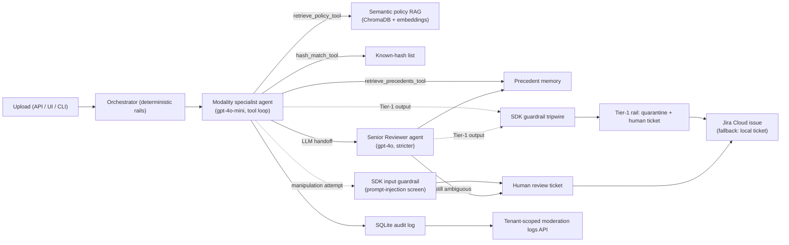

# Sentinel — Agentic Content Moderation on Deterministic Rails

**Real LLM agents adjudicate content. Hard-coded rails guard the agents. The AI has no ticketing tool, so it can neither create nor skip an escalation.**

I've worked policy enforcement queues for real: moderation teams drown in volume, policy is nuanced, and a single wrong call makes headlines. Platforms bolt together classifiers, spreadsheets, and ticket queues — and none of it can explain *why* something was removed. Sentinel is the tool I wish my teams had: an API-first, multimodal moderation platform where **OpenAI Agents SDK** agents make policy-grounded judgments and deterministic code enforces the invariants no AI should ever be trusted with.

## Why this is genuinely agentic (receipts, not claims)

| Capability | Where to look |
|---|---|
| Multi-agent tool loop — specialists ground verdicts via semantic policy RAG, precedent memory, hash-list tools | `sentinel/agents/runtime.py`, `sentinel/tools/policy_retrieval.py`, `sentinel/tools/precedent_memory.py` |
| **LLM-initiated handoff** — the specialist itself decides to escalate to the stricter Senior Reviewer (`gpt-4o`) mid-run | `handoffs=[senior]` in `sentinel/agents/runtime.py` |
| **Output guardrail tripwire** — any Tier-1 verdict (child safety, terrorism) halts the agent mid-run; quarantine + human ticket follow deterministically | `sentinel/guardrails.py`, Tier-1 rail in `sentinel/agents/orchestrator.py` |
| **Input guardrail tripwire** — uploads that attack the moderator ("ignore all previous instructions…") are screened **before adjudication**: ~36 ms, zero tokens, straight to a human ticket | `injection_input_guardrail` in `sentinel/guardrails.py` |
| **Native OpenAI platform trace per case** — every production run links to its trace (tool spans, handoff, guardrail spans) on platform.openai.com | trace wrapper in `sentinel/agents/orchestrator.py` |
| **Live agent streaming** — SDK `RunHooks` render tool calls and handoffs in the UI while the run is in flight | `sentinel/agents/live_events.py` |
| Structured outputs, run context, per-model token accounting | `AssessmentOutput` / `ModerationContext` in `sentinel/agents/runtime.py` |

**The safety thesis:** agentic judgment on deterministic rails. Tier-1 always quarantines and escalates, ambiguity always gets senior review, escalation always produces a ticket (mirrored to **Jira Cloud** when configured), unanalyzable content fails closed to human review — and the agents deliberately have **no ticketing tool**. The agents judge the content; the rails guard the agents.


```mermaid
flowchart LR
  Upload["Upload (API / UI / CLI)"] --> Router["Orchestrator (deterministic rails)"]
  Router --> Spec["Modality specialist agent\n(gpt-4o-mini, tool loop)"]
  Spec -->|retrieve_policy_tool| RAG["Semantic policy RAG\n(ChromaDB + embeddings)"]
  Spec -->|retrieve_precedents_tool| Prec["Precedent memory"]
  Spec -->|hash_match_tool| Hash["Known-hash list"]
  Spec -->|LLM handoff| Senior["Senior Reviewer agent\n(gpt-4o, stricter)"]
  Spec -.->|Tier-1 output| Trip["SDK guardrail tripwire"]
  Senior -.->|Tier-1 output| Trip
  Spec -.->|manipulation attempt| InTrip["SDK input guardrail\n(prompt-injection screen)"]
  InTrip --> Ticket["Human review ticket"]
  Trip --> Rail["Tier-1 rail: quarantine + human ticket"]
  Senior -->|still ambiguous| Ticket
  Rail --> Jira["Jira Cloud issue\n(fallback: local ticket)"]
  Ticket --> Jira
  Senior --> Prec
  Spec --> Audit["SQLite audit log"]
  Audit --> Logs["Tenant-scoped moderation logs API"]
```

## Numbers

From the committed golden-set evaluation (`sentinel/eval_runs/reference-live/`, 36 labeled synthetic cases, live agents on the 18 text cases):

- **Tier-1 recall: 100%** (the invariant — never missed, never adjudicated by AI)
- **Benign false-positive rate: 0%**
- **Outcome accuracy: 16/18 live text cases (88.9%)** against T&S-labeled outcomes — and both misses were *over-escalations to human review*, never under-enforcement
- **$0.002 estimated cost per live text case** at published per-token rates, ~7 s mean latency — versus **$0.50–$2.00 and hours-to-days** for human-queue review

Scope, stated plainly: the live run covers the 18 text cases, so 88.9% is a
small-*n* figure whose value is the *direction* of its failures, not its
precision. The golden set labels each case with its true modality, so these
numbers measure the rails under honest input. Adversarial input — a spoofed
`asset_type`, a non-canonical category label — is handled by separate
deterministic checks covered in the test suite, not by these metrics.

## Run it in 3 commands

```powershell
python -m venv .venv && .venv\Scripts\pip install -r sentinel/requirements.txt
# put OPENAI_API_KEY=sk-... in .env.local (runs offline in deterministic synthetic mode without it)
python sentinel/main.py --reset-db --seed-demo
streamlit run sentinel/app.py
```

Or containerized: `docker compose up --build` (API on :8000, UI on :8501).

280+ offline tests (`python -m pytest`), fully hermetic — the suite scrubs `OPENAI_API_KEY` and `JIRA_*` so it can never call the API, export traces, or open real issues. CI runs them on every push, gates on `ruff` / `mypy` / `pip-audit`, and asserts the Tier-1 recall and benign false-positive invariants against the offline golden set.

Beyond the demo, the service ships production controls (all opt-in via env, documented in `sentinel/.env.example`): a **human review queue** where reviewers resolve escalations into the audit trail, **bring-your-own-policy** taxonomies (`SENTINEL_POLICY_FILE` — tier-1 rails derived from your tiers, not hardcoded categories), **signed verdict webhooks** with an SSRF host-allowlist and retry-on-transient, **API keys with scopes, expiry, and one-step rotation**, attributable **named admin tokens**, per-IP **rate limiting** plus a global daily spend ceiling, a password gate on the paid UI surface, an opt-in **allow-verdict cache** (only benign verdicts cached, invalidated on policy change), **encryption at rest** for quarantined content, scheduled **backup and retention** sidecars, and `/health` + `/metrics` + request-ID observability.

Operational docs: [`SECURITY.md`](SECURITY.md) (posture and honest gaps), [`docs/ACCESSIBILITY.md`](docs/ACCESSIBILITY.md), and template [`docs/legal/`](docs/legal/) policies (ToS, Privacy, AUP — counsel review required before use).

## Screenshots


## More

- **Security posture, deployment assumptions, and known limitations:** [`SECURITY.md`](SECURITY.md) — read this before deploying. Notably, `hash_match.py` is an *integration seam* for PhotoDNA/PDQ that matches on fixture metadata, not a real perceptual-hash corpus; it provides no actual known-content detection as written.
- **Full documentation** (setup, Jira integration, API, CLI, eval harness, demo script): [`sentinel/README.md`](sentinel/README.md)
- **Submission one-pager:** [`docs/SUBMISSION.md`](docs/SUBMISSION.md)
- **Demo video script:** [`docs/DEMO_SCRIPT.md`](docs/DEMO_SCRIPT.md)

*No real illegal content exists anywhere in this repository. Tier-1 fixtures are clearly-labeled text stand-ins used only to verify routing.*
