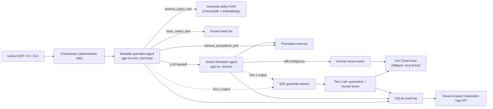

# Sentinel — Agentic Content Moderation

Sentinel is an API-first, multimodal Trust & Safety moderation platform. Uploaded image, audio, video, and text assets are reviewed by **real LLM agents** (OpenAI Agents SDK) that ground every verdict in a community-guidelines corpus via **semantic policy retrieval**, check **precedent memory**, and hand off ambiguous cases to a stricter **Senior Reviewer agent**. Tier-1 categories (child exploitation, terrorism/violent extremism) are never adjudicated by AI: an **SDK output guardrail halts the agent mid-run**, the content is quarantined, and a human-review ticket is opened — mirrored to **Jira Cloud** when configured.

**Design principle: agentic judgment on deterministic rails.** The reasoning is agentic — a genuine tool-calling loop, LLM-initiated handoffs, structured verdicts. The policy invariants are code — Tier-1 always quarantines and escalates, ambiguity always gets senior review, escalation always produces a ticket, and the agents deliberately have **no ticketing tool**, so the AI can neither create nor skip an escalation. Unanalyzable content **fails closed** to human review, never to auto-allow.

No real illegal content is included anywhere. Tier-1 fixtures are labeled stand-ins used only to verify routing.

## Architecture



Key modules:

- `sentinel/agents/runtime.py` — the agent runtime: specialist + senior `Agent` definitions, `Runner.run_sync` execution, structured `AssessmentOutput`, trace extraction.
- `sentinel/agents/orchestrator.py` — deterministic rails: modality dispatch, Tier-1 guardrail, guaranteed senior review, ticketing, quarantine, audit.
- `sentinel/guardrails.py` — the Tier-1 output guardrail (SDK tripwire + post-check).
- `sentinel/tools/` — policy retrieval (semantic + keyword fallback), policy index builder, precedent memory, hash matching, Jira client, ticketing, audit log, API keys.
- `sentinel/eval/run_eval.py` — golden-set evaluation harness.
- `sentinel/api.py` — FastAPI surface; `sentinel/app.py` — Streamlit demo UI; `sentinel/main.py` — CLI.

## Setup

```powershell
python -m venv .venv
.venv\Scripts\pip install -r sentinel/requirements.txt
```

Create `.env.local` at the repository root:

```
OPENAI_API_KEY=sk-...
# Optional model overrides (defaults shown)
SENTINEL_SPECIALIST_MODEL=gpt-4o-mini
SENTINEL_SENIOR_MODEL=gpt-4o
```

Build the semantic policy index once (rebuild after editing the policy corpus):

```powershell
python -m sentinel.tools.policy_index
```

Without an API key the system still runs end-to-end in deterministic synthetic mode (labels drive verdicts) — used by the offline test suite and as the rehearsed demo fallback.

### Jira Cloud escalation (optional)

1. Create a free site at <https://www.atlassian.com/software/jira/free> and a project (note its key, e.g. `MOD`).
2. Create an API token at <https://id.atlassian.com/manage-profile/security/api-tokens>.
3. Add to `.env.local`:

```
JIRA_BASE_URL=https://your-site.atlassian.net
JIRA_EMAIL=you@example.com
JIRA_API_TOKEN=...
JIRA_PROJECT_KEY=MOD
```

Escalated cases then open real Jira issues (priority from severity tier, policy citation, rationale, labels). If Jira is unreachable the local ticket still exists — an escalation is never lost.

## Streamlit demo

```powershell
streamlit run sentinel/app.py
```

- **Moderation** — upload an asset, watch the agent trace (tool calls, handoffs, guardrail halts), see the verdict card with clause citations and the Jira link.
- **Logs** — tenant moderation logs with escalation details.
- **Metrics** — golden-set evaluation runs: accuracy, Tier-1 recall, benign false-positive rate, per-outcome P/R/F1, confusion matrix, misses.

## Evaluation

```powershell
python -m sentinel.eval.run_eval          # offline, deterministic, no network
python -m sentinel.eval.run_eval --live   # real agents on the text golden set
```

Each run writes `results.json` + `report.md` under `sentinel/eval_runs/`. The golden set is 36 labeled synthetic cases across all four modalities (`sentinel/data/synthetic_cases/manifest.json`). Reference live run: **83.3% outcome accuracy, 100% Tier-1 recall, 0% benign false positives**.

## API

```powershell
$env:SENTINEL_ADMIN_TOKEN="replace-with-a-long-random-admin-secret"
uvicorn sentinel.api:app --reload
```

Mint a tenant API key (shown once, stored hashed):

```powershell
Invoke-RestMethod -Method Post -Uri "http://127.0.0.1:8000/admin/api-keys" `
  -Headers @{ Authorization = "Bearer $env:SENTINEL_ADMIN_TOKEN" } `
  -ContentType "application/json" `
  -Body '{"tenant_name":"Example Platform","project_name":"Production Moderation","environment":"live"}'
```

Moderate content (text inline, media as `content_base64`):

```powershell
Invoke-RestMethod -Method Post -Uri "http://127.0.0.1:8000/moderation/cases" `
  -Headers @{ Authorization = "Bearer sent_live_..." } `
  -ContentType "application/json" `
  -Body '{"case_id":"ZD-123","asset_type":"text","content":"content to moderate","source_system":"zendesk","external_reference":"ZD-123"}'
```

The response carries the verdict, the enforcement action (`allow` / `reject` / `escalate`), the agent trace, a normalized `ticketing_payload` (Jira/ServiceNow/Zendesk/webhook), and — when Jira is configured and the case escalated — `integration.jira.key` / `url` for the created issue. `GET /moderation/logs` lists the tenant's decisions; `POST /admin/api-keys/{id}/revoke` kills a key instantly.

## CLI

```powershell
python sentinel/main.py --reset-db --clear-precedents --repeat 2   # batch + learning metric
python sentinel/main.py --case-id tier1-child-standin-001          # Tier-1 routing demo
```

## Tests

```powershell
python -m pytest sentinel/tests -q
```

25 tests, fully offline: acceptance flows, production-path mapping, API + key auth, Jira escalation (mocked transport), log formatting, UI helpers. A conftest fixture scrubs `JIRA_*` from the environment so test runs can never open real issues.

## Demo script (2–3 minutes)

1. **The pain (15s).** Moderation teams drown in volume; policy is nuanced; mistakes make headlines. Companies bolt together classifiers, queues, and spreadsheets.
2. **Agentic flow (60s).** Upload an ambiguous post → the specialist agent retrieves policy clauses semantically, checks precedents, and hands off to the stricter senior agent → final verdict with the exact clause cited.
3. **The line AI must not cross (45s).** Upload a Tier-1 stand-in → the SDK guardrail halts the agent mid-run → quarantine + a real Jira ticket appears with severity and citation. *The AI cannot skip this escalation — it never had a ticketing tool.*
4. **Enterprise proof (30s).** Metrics page: golden-set accuracy, Tier-1 recall 100%, benign FPR 0%; tenant-scoped hashed API keys; full audit trail. Any platform can put this API in front of its upload path today.
